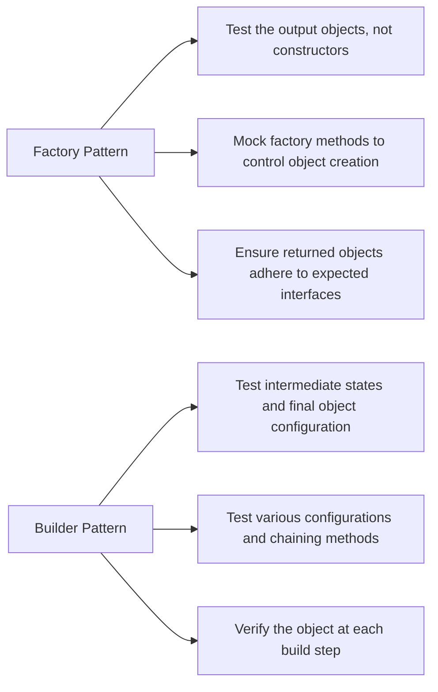

---
# You can also start simply with 'default'
theme: seriph
# random image from a curated Unsplash collection by Anthony
# like them? see https://unsplash.com/collections/94734566/slidev
background: https://devio2023-media.developers.io/wp-content/uploads/2021/10/pytest-1-scaled.jpg
# some information about your slides (markdown enabled)
title: pytest sharing
info: |
  ## Slidev Starter Template
  Presentation slides for developers.

  Learn more at [Sli.dev](https://sli.dev)
# apply unocss classes to the current slide
class: text-center
# https://sli.dev/features/drawing
drawings:
  persist: false
# slide transition: https://sli.dev/guide/animations.html#slide-transitions
transition: slide-left
# enable MDC Syntax: https://sli.dev/features/mdc
hideInToc: true # whether it gets hidden in table of content
mdc: true
---

# Ensuring Robustness in Data Science and Machine Learning:

A Guide to Testing with pytest

<div class="pt-12">
  <span @click="$slidev.nav.next" class="px-2 py-1 rounded cursor-pointer" hover="bg-white bg-opacity-10">
    Press Space for next page <carbon:arrow-right class="inline"/>
  </span>
</div>

<div class="abs-br m-6 flex gap-2">
  <button @click="$slidev.nav.openInEditor()" title="Open in Editor" class="text-xl slidev-icon-btn opacity-50 !border-none !hover:text-white">
    <carbon:edit />
  </button>
  <a href="https://github.com/slidevjs/slidev" target="_blank" alt="GitHub" title="Open in GitHub"
    class="text-xl slidev-icon-btn opacity-50 !border-none !hover:text-white">
    <carbon-logo-github />
  </a>
</div>

<!--
The last comment block of each slide will be treated as slide notes. It will be visible and editable in Presenter Mode along with the slide. [Read more in the docs](https://sli.dev/guide/syntax.html#notes)
-->

---
layout: default
hideInToc: true
transition: fade-out
---


# Table of contents

<Toc maxDepth="1"></Toc>

<style>
h1 {
  background-color: #2B90B6;
  background-image: linear-gradient(45deg, #4EC5D4 10%, #146b8c 20%);
  background-size: 100%;
  -webkit-background-clip: text;
  -moz-background-clip: text;
  -webkit-text-fill-color: transparent;
  -moz-text-fill-color: transparent;
}
</style>


---
transition: fade-out
---

# The Importance of Testing
Why is testing a must for robust data science work?

<div
  v-if="$slidev.nav.currentPage === 3"
  v-motion
  :initial="{ x: -100, opacity: 0}"
  :enter="{ x: 0, opacity: 1, scale: 1, transition: { delay: 100, duration: 1300 } }"
>

<p>

- 🛠 **Ensuring Reliability:** - Without proper testing, models may produce incorrect results, leading to potentially costly mistakes

- 📖 **Maintaining Code Quality:** - Consistent testing helps maintain high code quality, making it easier to refactor, optimize, and extend your DS codebase

- 🏭 **Preventing Regressions:** - Tests act as a safety net, preventing new changes from breaking existing functionality, which is particularly important in complex and large scaled DSML pipelines

</p>
</div>
<br>
<br>

Head over to [pytest documentation](https://docs.pytest.org/en/stable/) for more information

<!--
You can have `style` tag in markdown to override the style for the current page.
Learn more: https://sli.dev/features/slide-scope-style
-->

<style>
h1 {
  background-color: #2B90B6;
  background-image: linear-gradient(45deg, #4EC5D4 10%, #146b8c 20%);
  background-size: 100%;
  -webkit-background-clip: text;
  -moz-background-clip: text;
  -webkit-text-fill-color: transparent;
  -moz-text-fill-color: transparent;
}
p {
  font-family: 'Comic Sans MS', cursive, sans-serif;
  font-size: 16px;
  color: #333;
}
</style>

<!--
Here is another comment.
-->


---
transition: slide-up
---

# Invoking pytest
Assuming `pytest` library is installed successfully as a project dependency

```python {*}
# Run tests in a module
pytest test_mod.py

# Run tests in a directory
pytest testing/

# Run tests by keyword expressions
# Run tests with substring 'MyClass' and exclude those that contains 'method'
pytest -k 'MyClass and not method'

# Verbosity related

# quiet mode
pytest -q
# increase verbosity, display individual test names
pytest -v

# more verbose, display more details from the test output               
pytest -vv              
```

<style>
h1 {
  background-color: #2B90B6;
  background-image: linear-gradient(45deg, #4EC5D4 10%, #146b8c 20%);
  background-size: 100%;
  -webkit-background-clip: text;
  -moz-background-clip: text;
  -webkit-text-fill-color: transparent;
  -moz-text-fill-color: transparent;
}
p {
  font-family: 'Comic Sans MS', cursive, sans-serif;
  font-size: 14px;
  color: #333;
}
</style>

---
transition: fade-out
layout: two-cols-header
---

# Assertions, Fixtures and Parameterization 
Some common assertions (non-exhaustive) to consider for Data Science work:

::left::
<p>

1. Data integrity related assertions
   - data types
   - missing values
   - correctness of the fields

2. Data transformation assertions
   - derived features are processed correctly
3. Statistical assertions
   -  distributional properties are as expected
4. Model assertions
   -  performance is stable
   - output format is correct
  
</p>

::right::

```python{*}
@pytest.fixture
def sample_dataframe():
    data = {
        'A': [1, 2, 3, 4, 5],
        'B': [5, 4, 3, 2, 1],
        'C': ['a', 'b', 'c', 'd', 'e']
    }
    return pd.DataFrame(data)

# Parameterized test for data types
@pytest.mark.parametrize("column, expected_dtype", [
    ('A', np.int64),
    ('B', np.int64),
    ('C', object)
])
def test_data_types(sample_dataframe, column, expected_dtype):
    assert sample_dataframe[column].dtype == expected_dtype

# Parameterized test for missing values
@pytest.mark.parametrize("column", ['A', 'B', 'C'])
def test_no_missing_values(sample_dataframe, column):
    assert sample_dataframe[column].isnull().sum() == 0
```


<style>
h1 {
  background-color: #2B90B6;
  background-image: linear-gradient(45deg, #4EC5D4 10%, #146b8c 20%);
  background-size: 100%;
  -webkit-background-clip: text;
  -moz-background-clip: text;
  -webkit-text-fill-color: transparent;
  -moz-text-fill-color: transparent;
}
p {
  font-family: 'Comic Sans MS', cursive, sans-serif;
  font-size: 14px;
  color: #333;
}
</style>

---
transition: slide-up
---

# Monkeypatching / Mocking (1)
Useful for simulating an external dependency, e.g., API Interaction

 It allows you to <span style="color: red;">isolate the unit of code</span> being tested by simulating external dependencies, ensuring that tests focus solely on the functionality of the code under test


Example 1: Using pytest-mock

```python{*}{maxHeight:'300px'}
def fetch_stock_data(ticker: str) -> pd.DataFrame:
    stock = yf.Ticker(ticker)
    return stock.history(period="1d")

def test_fetch_stock_data(mocker):
    # Expected DataFrame
    expected_df = pd.DataFrame({
        "Open": [100.0],
        "High": [105.0],
        "Low": [95.0],
        "Close": [102.0],
        "Volume": [1000]
    })
    
    # Patch the history method to return the expected DataFrame
    mocker.patch.object(yf.Ticker, 'history', return_value=expected_df)
    
    # Call the function
    ticker = "AAPL"
    result = fetch_stock_data(ticker)
    
    # Assert the result
    pd.testing.assert_frame_equal(result, expected_df)


```

<style>
h1 {
  background-color: #2B90B6;
  background-image: linear-gradient(45deg, #4EC5D4 10%, #146b8c 20%);
  background-size: 100%;
  -webkit-background-clip: text;
  -moz-background-clip: text;
  -webkit-text-fill-color: transparent;
  -moz-text-fill-color: transparent;
}
p {
  font-family: 'Comic Sans MS', cursive, sans-serif;
  font-size: 14px;
  color: #333;
}
</style>


---
transition: slide-up
---

# Monkeypatching / Mocking (2)
Useful for simulating an external dependency, e.g., API Interaction

Example 2: Using monkeypatch

```python{*}{maxHeight:'400px'}
# Your function
def fetch_stock_data(ticker: str):
    stock = yf.Ticker(ticker)
    return stock.history(period="1d")

# Test function using monkeypatch
def test_fetch_stock_data(monkeypatch):
    # Mock response
    mock_history = pd.DataFrame({
        "Open": [100.0],
        "High": [105.0],
        "Low": [95.0],
        "Close": [102.0],
        "Volume": [1000]
    })

    # Mock function to replace the real `history` call
    def mock_get_history(self, period):
        return mock_history
    
    # Use monkeypatch to replace `history` method
    monkeypatch.setattr(yf.Ticker, "history", mock_get_history)
    
    # Call the function
    result = fetch_stock_data("AAPL")
    
    # Assertions to validate the results
    assert result.equals(mock_history)
```

<style>
h1 {
  background-color: #2B90B6;
  background-image: linear-gradient(45deg, #4EC5D4 10%, #146b8c 20%);
  background-size: 100%;
  -webkit-background-clip: text;
  -moz-background-clip: text;
  -webkit-text-fill-color: transparent;
  -moz-text-fill-color: transparent;
}
p {
  font-family: 'Comic Sans MS', cursive, sans-serif;
  font-size: 14px;
  color: #333;
}
</style>


---
transition: fade-out
---

# Handling Failures
Useful command for caching and debugging

<div grid="~ cols-2 gap-4">
<div>

**Prioritizing failed tests:**

```python{*}
# Only re-run the failures
pytest --lf
pytest --last-failed

# Re-run the failures first and then the rest
pytest --ff
pytest --failed-first

# runs the full test suite (default behavior)
pytest --last-failed --last-failed-no-failures all  
# runs no tests and exits successfully  
pytest --last-failed --last-failed-no-failures none   

# clear cache
pytest --cache-clear
```
</div>

<div>

**Python debugger:**
```bash{*}
# Suppose we encountered the following failed case
# It will go into debugger mode in terminal (Pdb)
assert set(result.columns) == {"WAFER_SCRIBE"}

# Useful commands to consider:

# print the result dataframe
p result

# print the columns
p result.columns

# inspect the first 5 rows
p result.head()

# continue executing the rest
c

```
</div>
</div>

<style>
h1 {
  background-color: #2B90B6;
  background-image: linear-gradient(45deg, #4EC5D4 10%, #146b8c 20%);
  background-size: 100%;
  -webkit-background-clip: text;
  -moz-background-clip: text;
  -webkit-text-fill-color: transparent;
  -moz-text-fill-color: transparent;
}
p {
  font-family: 'Comic Sans MS', cursive, sans-serif;
  font-size: 14px;
  color: #333;
}
</style>


---
transition: fade-out
---
# Unit tests vs Integration tests
Comparisons

| Aspect         | Unit Tests                          | Integration Tests                      |
|----------------|-------------------------------------|----------------------------------------|
| <kbd>Scope</kbd>      | Individual components or functions  | Multiple components or systems         |
| <kbd>Dependencies</kbd>   | Mocked or isolated                  | Real dependencies (depends on criticality*)                     |
| <kbd>Speed</kbd>          | Fast                                | Slower                                 |
| <kbd>Purpose</kbd>        | Verify correctness of small units   | Verify interactions between components |
| <kbd>Complexity</kbd>     | Simple                              | More complex                           |
| <kbd>Execution</kbd>      | Frequent                            | Less frequent                          |
| <kbd>Failure Impact</kbd> | Low                                 | High                                   |

<style>
h1 {
  background-color: #2B90B6;
  background-image: linear-gradient(45deg, #4EC5D4 10%, #146b8c 20%);
  background-size: 100%;
  -webkit-background-clip: text;
  -moz-background-clip: text;
  -webkit-text-fill-color: transparent;
  -moz-text-fill-color: transparent;
}
p {
  font-family: 'Comic Sans MS', cursive, sans-serif;
  font-size: 14px;
  color: #333;
}
</style>

---
transition: fade-out
---
# Impact of Design Pattern on Testing
Some examples on how different design patterns affect the method and focus of testing

<div grid="~ cols-2 gap-4">
<div>


</div>
<div>

```python{*}
def test_shape_factory():
    factory = ShapeFactory()

    circle = factory.create_shape("circle")
    assert isinstance(circle, Circle)
    assert circle.draw() == "Drawing a Circle"

    square = factory.create_shape("square")
    assert isinstance(square, Square)
    assert square.draw() == "Drawing a Square"
```
<br>
<br>

```python{*}
def test_car_builder():
    builder = CarBuilder()
    car = builder.add_engine("V8").add_wheels(4).build()

    assert car.engine == "V8"
    assert len(car.wheels) == 4
    assert all(wheel == "Wheel" for wheel in car.wheels)
```
</div>
</div>

<style>
h1 {
  background-color: #2B90B6;
  background-image: linear-gradient(45deg, #4EC5D4 10%, #146b8c 20%);
  background-size: 100%;
  -webkit-background-clip: text;
  -moz-background-clip: text;
  -webkit-text-fill-color: transparent;
  -moz-text-fill-color: transparent;
}
p {
  font-family: 'Comic Sans MS', cursive, sans-serif;
  font-size: 14px;
  color: #333;
}
</style>

---
transition: fade-out
---

# Code Coverage

<div grid="~ cols-2 gap-4">

<div>

Configuration:

```bash{12}
# pytest.ini
[pytest]
testpaths =
    tests
    integration
filterwarnings =
    ignore::DeprecationWarning:jupyter_client.connect
log_cli=true
log_level=NOTSET
log_format = %(asctime)s %(levelname)s %(message)s
log_date_format = %Y-%m-%d %H:%M:%S
addopts = --cov=my_package --cov-report=term-missing
```
</div>
<div>

Sample output:
<br>
<br>
<br>


</div>
</div>

<style>
h1 {
  background-color: #2B90B6;
  background-image: linear-gradient(45deg, #4EC5D4 10%, #146b8c 20%);
  background-size: 100%;
  -webkit-background-clip: text;
  -moz-background-clip: text;
  -webkit-text-fill-color: transparent;
  -moz-text-fill-color: transparent;
}
p {
  font-family: 'Comic Sans MS', cursive, sans-serif;
  font-size: 14px;
  color: #333;
}
</style>

---
layout: center
class: text-center
---

# Code Walkthrough

[Documentation](https://sli.dev) · [GitHub](https://github.com/slidevjs/slidev) · [Showcases](https://sli.dev/resources/showcases)

<PoweredBySlidev mt-10 />
