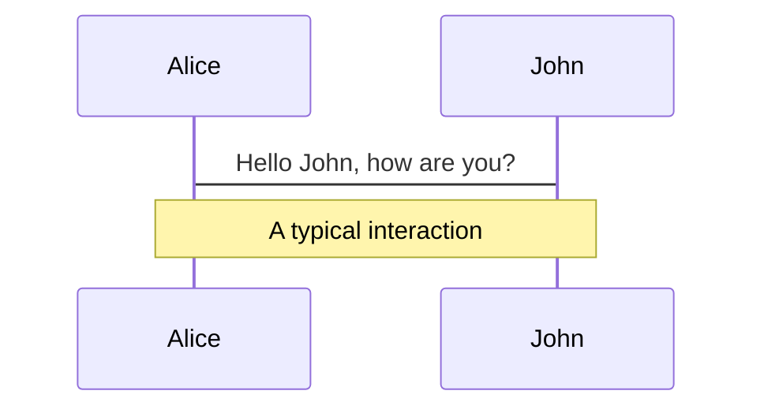
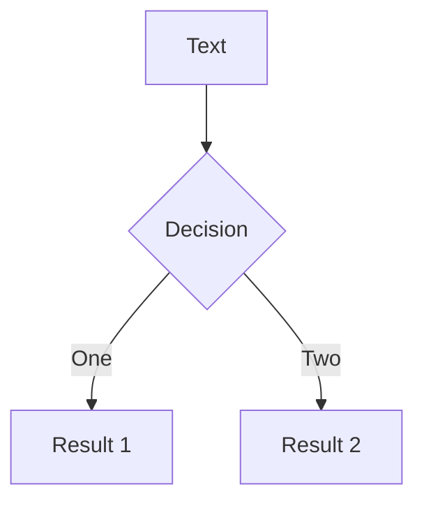
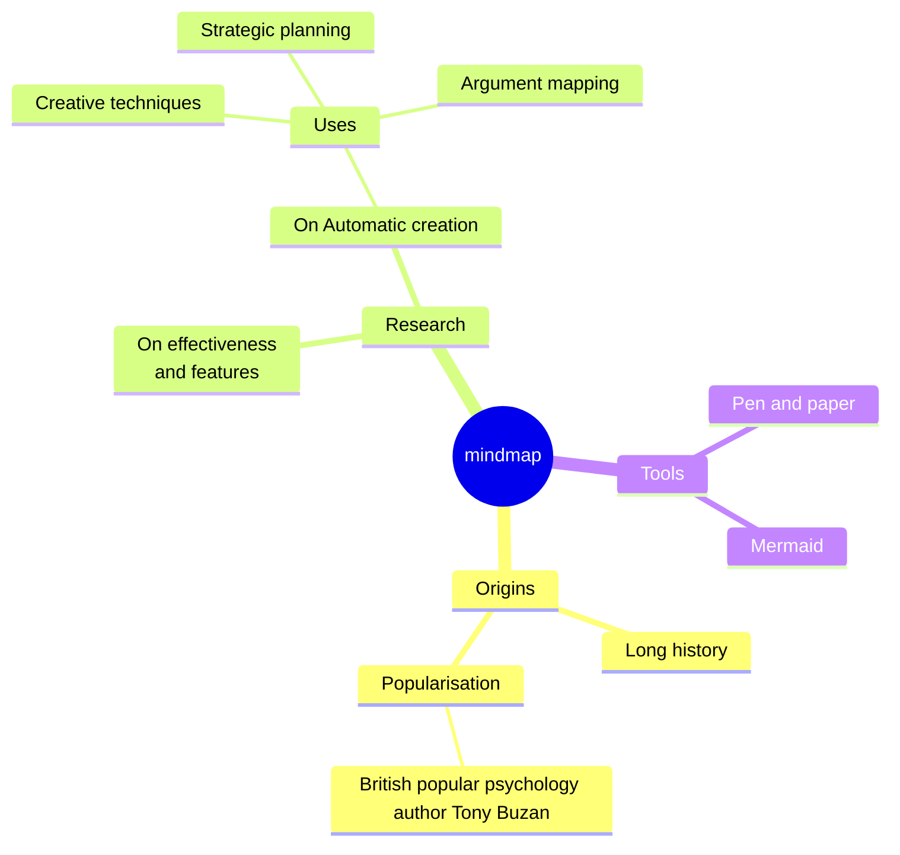
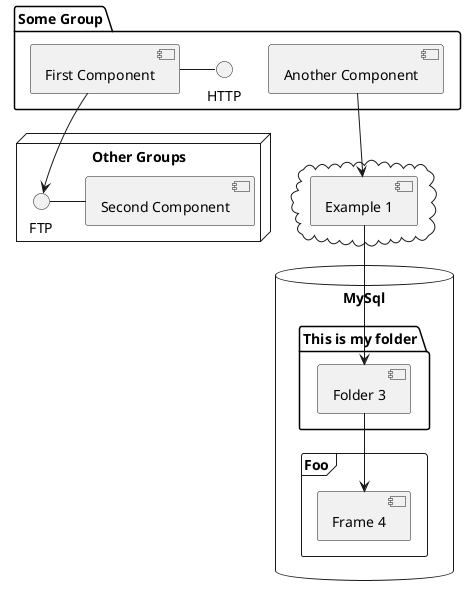

---
# You can also start simply with 'default'
theme: seriph
# random image from a curated Unsplash collection by Anthony
# like them? see https://unsplash.com/collections/94734566/slidev
background: https://devio2023-media.developers.io/wp-content/uploads/2021/10/pytest-1-scaled.jpg
# some information about your slides (markdown enabled)
title: pytest sharing
info: |
  ## Slidev Starter Template
  Presentation slides for developers.

  Learn more at [Sli.dev](https://sli.dev)
# apply unocss classes to the current slide
class: text-center
# https://sli.dev/features/drawing
drawings:
  persist: false
# slide transition: https://sli.dev/guide/animations.html#slide-transitions
transition: slide-left
# enable MDC Syntax: https://sli.dev/features/mdc
hideInToc: true # whether it gets hidden in table of content
mdc: true
---

# Ensuring Robustness in Data Science and Machine Learning:

A Guide to Testing with pytest

<div class="pt-12">
  <span @click="$slidev.nav.next" class="px-2 py-1 rounded cursor-pointer" hover="bg-white bg-opacity-10">
    Press Space for next page <carbon:arrow-right class="inline"/>
  </span>
</div>

<div class="abs-br m-6 flex gap-2">
  <button @click="$slidev.nav.openInEditor()" title="Open in Editor" class="text-xl slidev-icon-btn opacity-50 !border-none !hover:text-white">
    <carbon:edit />
  </button>
  <a href="https://github.com/slidevjs/slidev" target="_blank" alt="GitHub" title="Open in GitHub"
    class="text-xl slidev-icon-btn opacity-50 !border-none !hover:text-white">
    <carbon-logo-github />
  </a>
</div>

<!--
The last comment block of each slide will be treated as slide notes. It will be visible and editable in Presenter Mode along with the slide. [Read more in the docs](https://sli.dev/guide/syntax.html#notes)
-->

---
layout: default
hideInToc: true
transition: fade-out
---


# Table of contents

<Toc maxDepth="1"></Toc>

<style>
h1 {
  background-color: #2B90B6;
  background-image: linear-gradient(45deg, #4EC5D4 10%, #146b8c 20%);
  background-size: 100%;
  -webkit-background-clip: text;
  -moz-background-clip: text;
  -webkit-text-fill-color: transparent;
  -moz-text-fill-color: transparent;
}
</style>


---
transition: fade-out
---

# The Importance of Testing
Why is testing a must for robust data science work?

<div
  v-if="$slidev.nav.currentPage === 3"
  v-motion
  :initial="{ x: -100, opacity: 0}"
  :enter="{ x: 0, opacity: 1, scale: 1, transition: { delay: 100, duration: 1300 } }"
>

- 🛠 **Ensuring Reliability:** - Without proper testing, models may produce incorrect results, leading to potentially costly mistakes
- 📖 **Maintaining Code Quality:** - Consistent testing helps maintain high code quality, making it easier to refactor, optimize, and extend your DS codebase
- 🏭 **Preventing Regressions:** - Tests act as a safety net, preventing new changes from breaking existing functionality, which is particularly important in complex and large scaled DSML pipelines
</div>
<br>
<br>

Head over to [pytest documentation](https://docs.pytest.org/en/stable/) for more information

<!--
You can have `style` tag in markdown to override the style for the current page.
Learn more: https://sli.dev/features/slide-scope-style
-->

<style>
h1 {
  background-color: #2B90B6;
  background-image: linear-gradient(45deg, #4EC5D4 10%, #146b8c 20%);
  background-size: 100%;
  -webkit-background-clip: text;
  -moz-background-clip: text;
  -webkit-text-fill-color: transparent;
  -moz-text-fill-color: transparent;
}
</style>

<!--
Here is another comment.
-->

---
transition: slide-up
---

# Invoking pytest
Assuming `pytest` library is installed successfully as a project dependency

```python {*}{maxHeight:'250px'}
# Run tests in a module
pytest test_mod.py

# Run tests in a directory
pytest testing/

# Run tests by keyword expressions
# Run tests with substring 'MyClass' and exclude those that contains 'method'
pytest -k 'MyClass and not method'
```

<style>
h1 {
  background-color: #2B90B6;
  background-image: linear-gradient(45deg, #4EC5D4 10%, #146b8c 20%);
  background-size: 100%;
  -webkit-background-clip: text;
  -moz-background-clip: text;
  -webkit-text-fill-color: transparent;
  -moz-text-fill-color: transparent;
}
</style>

---
transition: slide-up
---

# Assertions, Fixtures and Parameterization
assertions, fixtures and parameterization

```python {*}
## Writing basic assertions

def test_dataframe_structure():
    # Call the function that should return a DataFrame
    df = generate_dataframe()

    # Check if the object is a DataFrame
    assert isinstance(df, pd.DataFrame), "The object is not a DataFrame"

    # Expected columns
    expected_columns = ["column1", "column2", "column3"]

    # Check if the DataFrame contains the expected columns
    assert list(df.columns) == expected_columns, (
        f"DataFrame columns do not match expected columns. Got {list(df.columns)}"
    )

## Define multiple sets of arguments and fixtures using @pytest.mark.parametrize 

@pytest.mark.parametrize("test_input,expected", [("3+5", 8), ("2+4", 6), ("6*9", 42)])
def test_eval(test_input, expected):
    assert eval(test_input) == expected
```

<style>
h1 {
  background-color: #2B90B6;
  background-image: linear-gradient(45deg, #4EC5D4 10%, #146b8c 20%);
  background-size: 100%;
  -webkit-background-clip: text;
  -moz-background-clip: text;
  -webkit-text-fill-color: transparent;
  -moz-text-fill-color: transparent;
}
</style>

---
transition: slide-up
---

# Monkeypatching / Mocking (1)
Useful for simulating an external dependency, e.g., API Interaction

```python{*}
## Monkeypatching config in dictionary
DEFAULT_CONFIG = {"user": "user1", "database": "db1"}


def create_connection_string(config=None):
    """Creates a connection string from input or defaults."""
    config = config or DEFAULT_CONFIG
    return f"User Id={config['user']}; Location={config['database']};"

def test_connection(monkeypatch):
    # Patch the values of DEFAULT_CONFIG to specific
    # testing values only for this test.
    monkeypatch.setitem(DEFAULT_CONFIG, "user", "test_user")
    monkeypatch.setitem(DEFAULT_CONFIG, "database", "test_db")

    # expected result based on the mocks
    expected = "User Id=test_user; Location=test_db;"

    # the test uses the monkeypatched dictionary settings
    result = create_connection_string()
    assert result == expected
```

<style>
h1 {
  background-color: #2B90B6;
  background-image: linear-gradient(45deg, #4EC5D4 10%, #146b8c 20%);
  background-size: 100%;
  -webkit-background-clip: text;
  -moz-background-clip: text;
  -webkit-text-fill-color: transparent;
  -moz-text-fill-color: transparent;
}
</style>


---
transition: slide-up
---

# Monkeypatching / Mocking (2)
Useful for simulating an external dependency, e.g., API Interaction

```python{*}
## Monkeypatching config in dictionary
DEFAULT_CONFIG = {"user": "user1", "database": "db1"}


def create_connection_string(config=None):
    """Creates a connection string from input or defaults."""
    config = config or DEFAULT_CONFIG
    return f"User Id={config['user']}; Location={config['database']};"

def test_connection(monkeypatch):
    # Patch the values of DEFAULT_CONFIG to specific
    # testing values only for this test.
    monkeypatch.setitem(DEFAULT_CONFIG, "user", "test_user")
    monkeypatch.setitem(DEFAULT_CONFIG, "database", "test_db")

    # expected result based on the mocks
    expected = "User Id=test_user; Location=test_db;"

    # the test uses the monkeypatched dictionary settings
    result = create_connection_string()
    assert result == expected
```

<style>
h1 {
  background-color: #2B90B6;
  background-image: linear-gradient(45deg, #4EC5D4 10%, #146b8c 20%);
  background-size: 100%;
  -webkit-background-clip: text;
  -moz-background-clip: text;
  -webkit-text-fill-color: transparent;
  -moz-text-fill-color: transparent;
}
</style>


---
layout: two-cols
layoutClass: gap-16
---


# LaTeX

LaTeX is supported out-of-box. Powered by [KaTeX](https://katex.org/).

<div h-3 />

Inline $\sqrt{3x-1}+(1+x)^2$

Block
$$ {1|3|all}
\begin{aligned}
\nabla \cdot \vec{E} &= \frac{\rho}{\varepsilon_0} \\
\nabla \cdot \vec{B} &= 0 \\
\nabla \times \vec{E} &= -\frac{\partial\vec{B}}{\partial t} \\
\nabla \times \vec{B} &= \mu_0\vec{J} + \mu_0\varepsilon_0\frac{\partial\vec{E}}{\partial t}
\end{aligned}
$$

[Learn more](https://sli.dev/features/latex)

---

# Diagrams

You can create diagrams / graphs from textual descriptions, directly in your Markdown.

<div class="grid grid-cols-4 gap-5 pt-4 -mb-6">









</div>

Learn more: [Mermaid Diagrams](https://sli.dev/features/mermaid) and [PlantUML Diagrams](https://sli.dev/features/plantuml)

---
foo: bar
dragPos:
  square: 691,32,167,_,-16
---

# Draggable Elements

Double-click on the draggable elements to edit their positions.

<br>

###### Directive Usage

```md

```

<br>

###### Component Usage

```md
<v-drag text-3xl>
  <carbon:arrow-up />
  Use the `v-drag` component to have a draggable container!
</v-drag>
```

<v-drag pos="663,206,261,_,-15">
  <div text-center text-3xl border border-main rounded>
    Double-click me!
  </div>
</v-drag>


###### Draggable Arrow

```md
<v-drag-arrow two-way />
```

<v-drag-arrow pos="67,452,253,46" two-way op70 />

---
src: ./pages/imported-slides.md
hide: false
---

---

# Monaco Editor

Slidev provides built-in Monaco Editor support.

Add `{monaco}` to the code block to turn it into an editor:

```ts {monaco}
import { ref } from 'vue'
import { emptyArray } from './external'

const arr = ref(emptyArray(10))
```

Use `{monaco-run}` to create an editor that can execute the code directly in the slide:

```ts {monaco-run}
import { version } from 'vue'
import { emptyArray, sayHello } from './external'

sayHello()
console.log(`vue ${version}`)
console.log(emptyArray<number>(10).reduce(fib => [...fib, fib.at(-1)! + fib.at(-2)!], [1, 1]))
```

---
layout: center
class: text-center
---

# Learn More

[Documentation](https://sli.dev) · [GitHub](https://github.com/slidevjs/slidev) · [Showcases](https://sli.dev/resources/showcases)

<PoweredBySlidev mt-10 />
